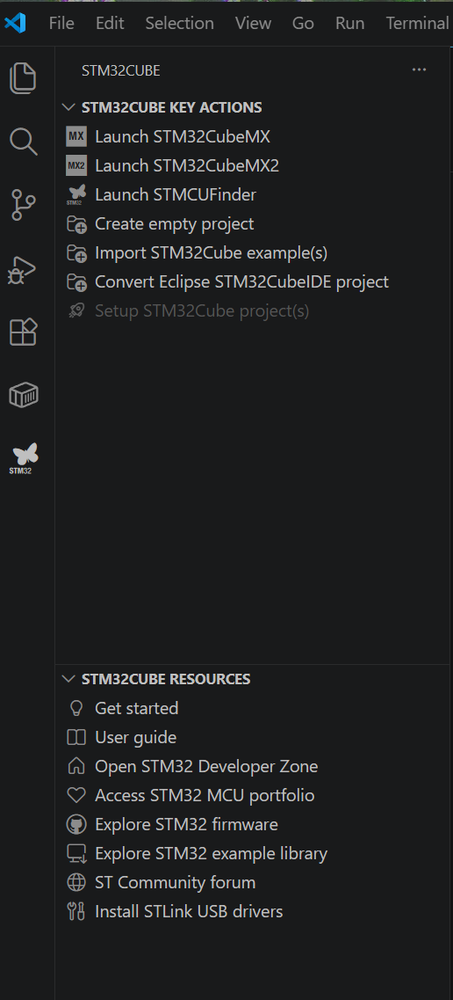

# LZ & Partner – Engineering Onboarding

This document provides a **short onboarding guide** for engineers working with the
LZ & Partner GitHub organization.

The goal is to get new developers productive quickly.
Detailed rules (naming, versioning, repository structure) are defined separately.

## Table of Contents

- [Organization and Rules](#organization-and-rules)
  - [Organizational Structure](#organizational-structure)
- [SSH-Key](#ssh-key)
- [Git in Powershell aufsetzen](#git-in-powershell-aufsetzen)
- [STM32 development environment setup](#stm32-development-environment-setup)
  - [Windows Setup](#windows-stm32-setup)
  - [Linux Setup](#linux-stm32-setup)
- [Latex setup in VSCode](#latex-setup-in-vscode)
- [Kicad setup](#kicad-setup)
  - [Windows setup](#windows-kicad-setup)
  - [Linux setup](#linux-kicad-setup)
- [Commit Regeln und konventionen](#commit-regeln-und-konventionen)
- [Troubleshooting](#troubleshooting)

---

## Organization and Rules
All hardware and software development is managed through this GitHub organization.

### Organisational structure
The final structure is still under definition. For now, the hierarchy follows this principle:

- GitHub Organization
  - Teams
    - Product Teams
    - Platform / Shared Components
    - Tooling & Infrastructure
  - Repositories
    - `product-*` (product-specific hardware, firmware, software)
    - `platform-*` (shared libraries and reusable components)
    - `tools-*` (internal tooling)
    - `infra-*` (CI/CD, automation)
    - `.github` (organization-wide defaults)


Access to repositories is managed via **GitHub Teams**.
Direct commits to protected branches are not allowed.

---

## SSH-Key

SSH-Keys are used to securely authenticate with GitHub without using a password. This guide should work for Windows and Linux

### 1. Generate the Key

To generate a new SSH-key open your terminal/cmd and use the following command to generate it. this is the default option with no additional information stored in it for more information read [this](https://docs.github.com/en/authentication/connecting-to-github-with-ssh/generating-a-new-ssh-key-and-adding-it-to-the-ssh-agent).
```
ssh-keygen
```
Now you have to select
-  File to store it in (default works except you want multi setup)
-  Passphrase either no or with passphrase the [link](https://docs.github.com/en/authentication/connecting-to-github-with-ssh/generating-a-new-ssh-key-and-adding-it-to-the-ssh-agent) provides additional information

### 2. Find and copy the key
Default locations:
- Windows:

    `C:\Users\YOUR_USERNAME\.ssh\id_ed25519.pub`

- Linux:

    `~/.ssh/id_wd25519.pub`

To print the key in your terminal

cat `~/.ssh/id?ed25519.pub`

Copy the entire output

### 3. Add SSH Key to GitHub 
  1. In your browser visit [GitHub](https://github.com) 
  2. Click on your Avatar in the top right corner
  3. Navigate to:
      - Settings
      - Access -> SSH and GPG keys
  4. Click "New SSH Key"
  5. Paste your key and save


### 4. Test the connection:

```
ssh -T git@github.com
```

The output should be something like this ```Hey YOURUSERNAME! You've successfully authenticated ....```

### Optional: multiple SSH keys
If you use multiple Git platforms or keys, configure `~/.ssh/config` per key like this:

```text
Host github.com
  HostName github.com
  User git
  IdentityFile ~/.ssh/github_key
```

---

## Setup Git in Powershell
If you prefer a Youtube-Tutorial please watch following [Tutorial](https://www.youtube.com/watch?v=TwKyqOf5mJ4) after that for a better experience jump to point 4. 

1. Install Git
   - Download Git from: https://git-scm.com/downloads
   - Use the default installation options
   - Ensure OpenSSH is enabled

2. Verify Installation
    ```powershell
    git --version
    ```

3. Configure Git Identity
Configure your global Git identity (required for commits):
    ```powershell    
    git config --global user.name "<your-github-username>"
    git config --global user.email "<your-company-email>"
    ```
    Verify configuration: `git config --list`
4. For a prettier Git in the Powershell terminal:)
    ```powershell
    Import-Module posh-git> Install-Module posh-git -Scope CurrentUser -Force
    Import-Module posh-git
    Add-PoshGitToProfile -AllHosts
    ```

    Now we add helpful extensions which indicate what is commited and what is ready to get pushed as well addistionally it shows the number of untracked files.
    ```powershell
    C:\Users\username\path\to\git\directory [main ≡ +1 ~1 -0 !]>
    ```    
5. Als Test kannst du die LoccoZ-Organisation Repository (gitlab-profile) klonen:
    ```powershell
    > cd C:\Users\$USERNAME$\path\to\desired\destination
    > git clone git@gitlab.com:loccoz-system-ag/loccoz-organization.git
    ```

---

## STM32 development environment setup

We setup VSCode for STM32 development.

### Windows STM32 Setup
1. Install VSCode using the following link [VSCode download](https://code.visualstudio.com/download)
2. Install the STM32 as well as Serial Monitor extension from the official Microsoft Marketplace

Besides your IDE you need additional external dependencies to start developing. We recommend creating an ST account to download the required software.

- STMicroelectronics.stm32-vscode-extension [STM-VSCode extension](https://marketplace.visualstudio.com/items?itemName=stmicroelectronics.stm32-vscode-extension)
- ms-vscode.vscode-serial-monitor [SerialMonitor extension](https://marketplace.visualstudio.com/items?itemName=ms-vscode.vscode-serial-monitor)

- [CubeClt](https://www.st.com/en/development-tools/stm32cubeclt.html) is a bundle of toolchain components. During installation use default settings and **do not change the installation location**.
- [CubeMX](https://www.st.com/en/development-tools/stm32cubeclt.html) is a graphical project configurator. As well use default settings and **do not change the installation location**.
- [MCUFinder](https://www.st.com/en/development-tools/st-mcu-finder-pc.html) is a graphical tool to select an ST device. Again use default settings and **do not change the installation location**.


After you've done everything it should look like that



Check if the most important tabs work by clicking through the extension panel, if everything launches you're fine. Following Key Actions should run:

- STM32CubeMX
- STMCUFinder
- Create empty project

Check if **ST-LINK firmware upgrades are required**: This is the case if the debugger on the development board is to old. You'll find it out if following error messages pup up

```
Could not find the task 'Build'
```

or

```
Unable to start debugging
```

To upgrade the firmware do the following:
- Plug in your board
- In VSCode, open the STM32 extension tab
- Under the Debug panel there is a tab where STM32 FAULT STATUS REGISTERS ... there should be a place to select "STMLink upgrade"
- Wait for updates to complete

If it still won't work enter the following command

```bash
stlinkupgrade
```

### Linux STM32 Setup

Install VSCode similar to the Windows installation
> **Important**: use your operating systems default package manager, snap/flatpack vversions may break.

- For each software component you have to download the appropriate .zip file from the ST website. Just use the generic Linux installers
- Unzip to a folder. For example, unzip the CubeMX installer to a folder called cubemx:
 
The default paths of the three important applications are:

 - [CubeCLT](https://www.st.com/en/development-tools/stm32cubeclt.html): ```/opt/st/```
 - [CubeMX](https://www.st.com/en/development-tools/stm32cubemx.html): ```/usr/local/...```
 - [MCUFinder](https://www.st.com/en/development-tools/st-mcu-finder-pc.html): ```/usr/local/STM...```

Example of unzip to a folder

```$ unzip en.stm32cubemx-lin-v6-12-0.zip -d cubemx```

Make the contained script **executable**:
```bash
> cd cubemx
> chmod +x SetupSTM32CubeMX-6.12.0
> sudo ./SetupSTM32CubeMX-6.12.0
```

If the script is not executed under sudo it may not correctly install all drivers and rules. During the installation prompts **install all additional components** (such as the st-link debug server). Importantly, **note the installation directory** for everything you install.

After installation the process is similar to windows read the following chapter [Setup STM32 for developing](#setup-stm32-for-developing)

Finally Install ncurses via apt:
```bash 
sudo apt update
sudo apt-get install libncurses5
```

The latest versions of ubuntu do not contain libncurses5 in their repositories anymore To install it manually, see [here](https://gist.github.com/schilkp/8fcab720fffc11cb0034010c1dc05404)

### Bugs and nice to know

- **Build fails because cmd.exe was not found** The windows command line could not be found by the build tools add it to the system path environment variable [Tutorial](https://www.thewindowsclub.com/how-to-add-edit-a-path-variable-in-windows) add the following path into the system environment variables ```C:\Windows\System32```
- **Bad CMake executable**. Check to make sure it is installed if not install CMake and Ninja
  1. Install [CMake](https://cmake.org/download/) installer and run it. Make sure to, when prompted, add CMake to the path of the current user. **This is not the default option**.
  2. Install the [Ninja](https://github.com/ninja-build/ninja/releases) build tool executable.
  3. Place the downloaded ```ninja.exe``` into the folder ```C:\Program Files\ninja```
  4. Add the ```C:\Program Files\ninja``` to your system path.
  5. Close and re-open VSCode


### Build STM32 Project

Start STM32CubeMX select New Project either select start project from MCU or Start My Project from ST Board. After you've selected the board navigate to ```Project Manager``` and at the point where you have to select the ```Toolchain / IDE``` select CMake and the default ```Compiler/Linker``` GCC. Then Generate Code.

**Important the project name has to be the same name as the toolchain location folder**

After your code is generated please open it with VSCode if you want to build it there is an icon in the bottom left corner to build the project. After the Build process finished please go to the Debug Section and run the project. Often you have to select the STM32STLink_GDB_Server to flash the STM32 MCU Board

[Here](https://community.st.com/t5/stm32-mcus/how-to-use-vs-code-with-stm32-microcontrollers/ta-p/742589) more details and a tutorial to Setup the Development environment.

---

## LaTeX setup in VSCode

To setup LaTeX for windows one needs to have TeX Live on Windows to install that use the following link and select a method to install it [TexLive Download](https://tug.org/texlive/windows.html). The installation may take some time depending on your laptop up to 3h.

In VSCode i recommend following extension from the extension manager with the following Extension-id:
- James-Yu.latex-workshop [To the Extension](https://marketplace.visualstudio.com/items?itemName=James-Yu.latex-workshop)

After you've setup all this you should see a build or compile symbol in the bottom left corner of your active VSCode session. To have a nice view on your latex project please open the report file and place it on the right hand side of your monitor.

### Install TexLive on Linux

To install TexLive on Linux use the following command:

```bash
sudo apt update
sudo apt install texlive-full
```

The rest should be similar to windows

---

## KiCad Setup

KiCad is a free and open source software which is widely used to design electrical circuits besides PCBs

### Windows KiCad Setup

To install KiCad on Windows simply navigate to [this](https://www.kicad.org/download/) page and select your operating system in our case Windows. You will get redirected to a page wehre Windows Downloads are available. Choose the latest stable release and your region i.e. Europe/Cern-Switzerland. Run the exe by clicking on it in the Explorer by double clicking on the ```Kicad-VERSION-Number-x86.exe``` it will open a winodw. Press continue or weiter. You now have to select following points in your installer (we recommend default settings).

- Local user or system wide installation
- Select components
- Select systempath

Installation should be finished

---

### Linux KiCad Setup

For Linux there exist two options: the default option using the installer from the [webpage](#webpage-setup) or the [console](#console-setup) installation.

#### Webpage setup

To install KiCad on Linux you have to visit [this](https://www.kicad.org/download/) web page.
- Select Linux and choose the latest stable release as well as your region Europe/Cern-Switzerland. It starts downloading a ```.tar``` file.
- Unpack the ```.tar``` file and run unpacked ```.AppImage``` file by clicking on it
- A window will Welcome... press next
- The next windows use default options (already selected by the setup wizard) and press next

KiCad should now be installed <span style="color:red">not 100% sure how to make installation persistant </span>

#### Console setup

Using the console it is straight forward

```
sudo apt update
sudo apt install kicad
```

Now it asks:
- Password (enter it)
- If you are sure to install it, either press y or j depending on your local language settings

Installations should be finished

---

## Commit Regeln und Konventionen 
https://www.conventionalcommits.org/en/v1.0.0/
Another recommendation for commits is to record commit messages at shorter intervals and after minor changes, rather than recording one commit message after many changes. You can think of this in the same way as progressing in a game:
In certain difficult games, if this option is available, you try to save your progress at short intervals. This gives you as the player security in case your avatar dies during the game, your city is reduced to rubble, or even worse, your machine suddenly breaks down.

---

## Troubleshooting
__Please list any problems you encounter during installation here.__ 
1. Creation of SSH keys for Miguel and Timo: 
   1. SSH key generation with ID_ED25519 protocol
   2. Key was renamed to __gitlab_key__ via command line attribute “-f” (instead of id_ed25519.pub -> gitlab_key.pub)
   3. Key was successfully generated and connected to the official Gitlab server.
   4. __Problem__: When attempting to clone a repository from the Loccoz-System-AG Group, the following error occurred:
        ```
        Could not access remote. Permission denied (publickey)
        fatal: could not reach repository
        ```

2. Setting up and building STM32 Project:
    1. Check if all STM32 tools are installed
    2. Don't build it on **OneDrive**
    3. cd directly in the project i.e. if you named your project Test cd directly into the project and after you're in the folder open visual studio code to compile